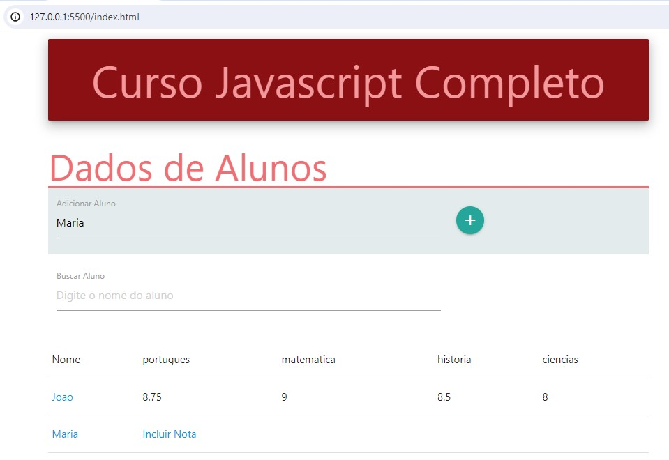

# 
   MVCS Design Pattern - List of Student Grades 

## Goal

This is was project made from the course [Curso de JavaScript Completo](https://www.udemy.com/course/javascript-completo-2018-do-iniciante-ao-mestre/?couponCode=GENAISALE24)

The goal to this project was build a list of student grades and practice the MVCS Architecture Pattern, which MVCS stand for Model, View, Controller ans Service.

Below is a screenshot of this project's web page.

## Concepts learned

Through this project it was possible to exercise how to work with the MVCS Architecture Pattern and lots of others concepts. 

One of the directly requirement of working with MVCS architecture pattern is  understand how to work with the dependency injection design pattern. That's because when we use the MVCS architecture pattern we need to instantiate services objects which have as parameters dependencies other objects such as model objects and/or view obejcts.
I could realized working with the Dependency Injection is not easy because we need every time to know what model or view is being used into a specific service and that becomes a little bit confusing as the software increases. So, I could realize while MVCS architecture pattern has a good advantage to divide the code into blocks of responsabilty it also has a not so good consequence which is increase the complexibility to the software engineer undestand the code flow that is essentially created by the design pattern dependency injection.

Through this project I could also exercise ho to work with localStorage, sessionStorage and also how to create events using old ways and the new way. The old way to create events is though  document.createEvent method and initiEvent method. The new way to create events is instantiating the Event class. 

#### This is the old way to create an Event. 
const inputEvent_IE = document.createEvent("Event") 
inputEvent_IE.initEvent("input", true, true)

#### This is the new way to create an Event. 
const inputEvent = new Event("input")

As this is a new way to create event it couldn't work in some browser. We must check [Can I Use Website]( https://caniuse.com/)
